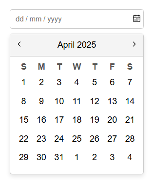

# Datepicker UI

#
A simple datepicker UI using HTML, CSS and JAVASCRIPT. CSS techniques like positioning & layout used for styling then enhanced it with JavaScript to make it a functional datepicker component.

#
Features include:

- Toggle calendar visibility when clicking the icon.
- Display correct month and year dynamically.
- Navigate between months using next/prev buttons.
- Populate the days dynamically based on the selected month.
- Update the input field when a date is selected.
